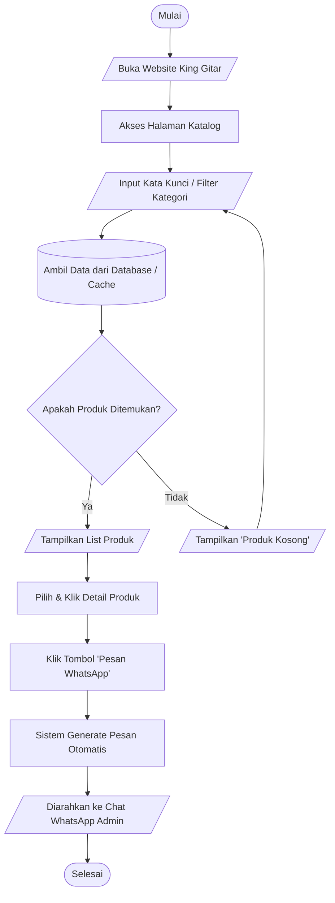
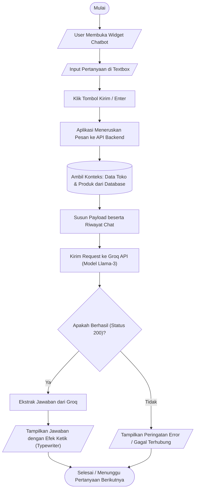
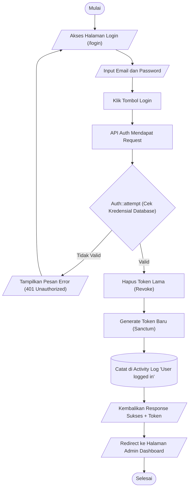
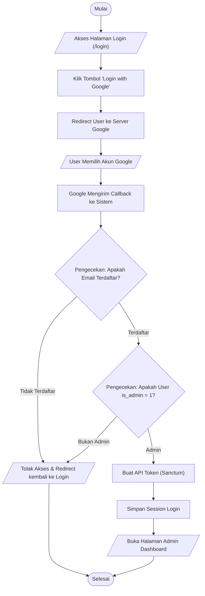
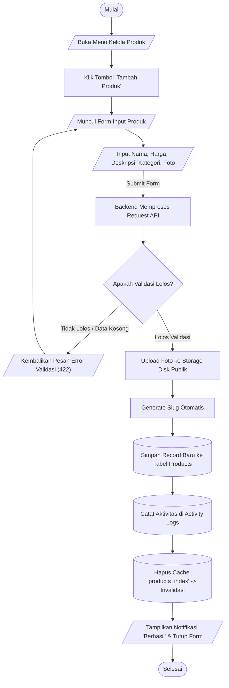
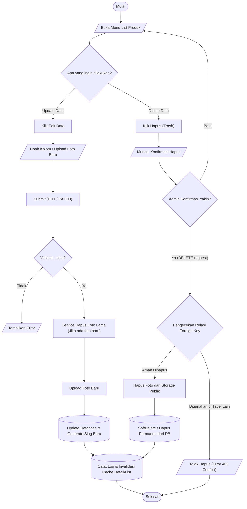

# Flowchart Sistem King Gitar

Dokumen ini berisi diagram alur (Flowchart) dari fitur-fitur utama di dalam sistem **King Gitar**. Diagram digambarkan menggunakan sintaks Mermaid.

---

## 📖 Panduan Simbol Flowchart

Berikut adalah jenis-jenis simbol dasar yang digunakan dalam flowchart ini beserta maknanya:

1. **Terminal / Terminator (Bentuk Oval / Kapsul)**
   - Simbol: `([ Teks ])`
   - Fungsi: Menunjukkan titik **AWAL (Mulai)** atau **AKHIR (Selesai)** dari sebuah alur program.
2. **Process / Proses (Bentuk Persegi Panjang)**
   - Simbol: `[ Teks ]`
   - Fungsi: Menunjukkan suatu **proses, perhitungan, atau aksi** yang dilakukan oleh sistem atau user.
3. **Data / Input-Output (Bentuk Jajar Genjang)**
   - Simbol: `[/ Teks /]`
   - Fungsi: Menunjukkan operasi **input** (memasukkan data) atau **output** (menampilkan hasil).
4. **Decision / Keputusan (Bentuk Belah Ketupat / Diamond)**
   - Simbol: `{ Teks }`
   - Fungsi: Menunjukkan titik **percabangan atau evaluasi kondisi** (Biasanya memiliki jawaban Ya / Tidak).
5. **Database / Penyimpanan (Bentuk Tabung / Silinder)**
   - Simbol: `[( Teks )]`
   - Fungsi: Menunjukkan proses mengambil atau menyimpan data ke dalam **Database**.

---

## 1. Alur Pemesanan / Pembelian Produk (Pengunjung Umum)
Alur ketika pengunjung website melihat katalog produk dan melakukan pemesanan via WhatsApp.

---

## 2. Alur Interaksi Chatbot AI (King Gitar AI)
Alur ketika pengunjung menggunakan fitur live chat AI untuk bertanya atau meminta rekomendasi.

---

## 3. Alur Autentikasi Admin (Login Standar: Email & Password)
Alur ketika admin masuk ke sistem panel dashboard menggunakan input email dan password secara manual.

---

## 4. Alur Autentikasi Admin (Login via Google OAuth)
Alternatif login admin menggunakan akun Google.

---

## 5. Alur Manajemen Data Admin (Create / Menambah Data)
Alur ketika admin berhasil login dan melakukan proses tambah data produk baru beserta gambar (Berlaku juga untuk kategori/banner).

---

## 6. Alur Manajemen Data Admin (Update & Delete Data)
Alur ketika admin mengubah (Update) data atau menghapus (Delete) data.

